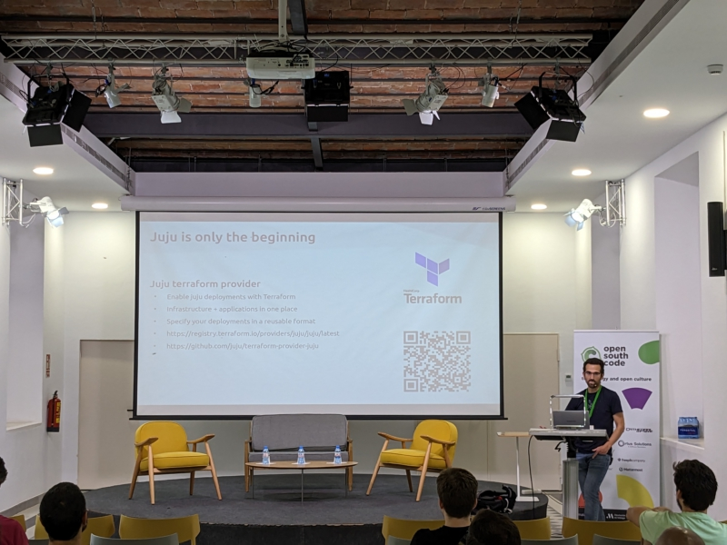
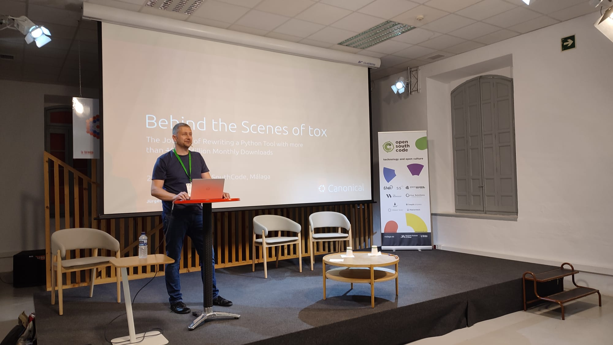
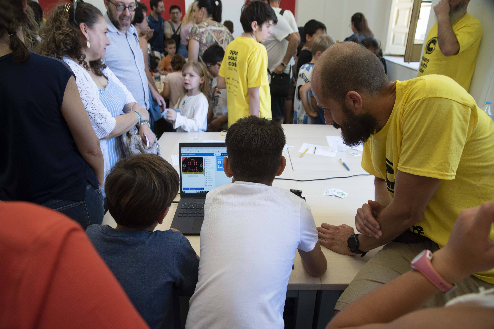
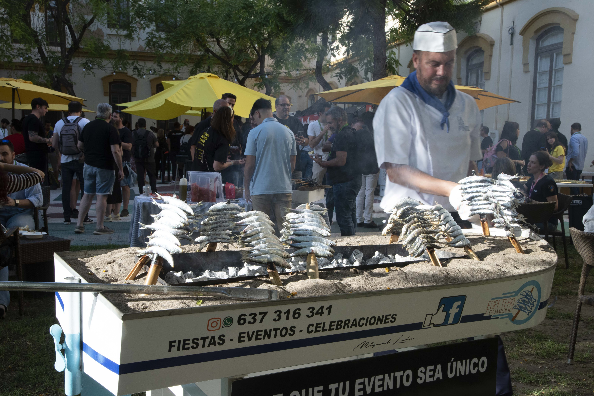

I had the honour of attending the [OpenSouthCode 2023](https://www.opensouthcode.org) held at the beatiful Málaga between June 9th and 10th. This is my brief summary of the event, and an invitation for everybody to attend this community-driven event.

## About OpenSouthCode

For those who have never heard about this conference, the OpenSouthCode has been celebrated for many years in Málaga. The main goal of the event is to promote open source technologies and it serves as a meeting point for the community, practitioners, and open source adopters. Over the years this annual meeting has evolved into a major conference attracting not only the community, but also sponsoring companies (VMWare and Mattermost sponsored this edition), professionals, free lancers, students, and families (I will explain this later) celebrating open source in an open and friendly environment. This edition was particularly special for the community, because it was the first after the Covid restrictions.

I have to say that part of the success of this conference is due to the huge efforts and dedication of the organizers (all of them volunteers) combined with the attraction that Malaga is having in the tech industry. Apart from being a well known destination for digital nomads, large companies such as Google or Vodafone have created divisions there. Other companies are following the same path creating a new vibrant ecosystem that grows and grows. Some peope talk about a new Silicon Valley in the South of Europe.

## The organization

The conference had 8 simultaneous tracks. One of them was fully dedicated to the KDE community which had its annual meeting inside the conference. Apart from the talks there were dedicated workshops. I could not attend all the talks for obvious reasons, but I would say DevOps/DevSecOps, data processing, and AI were major topics in this edition.

Sponsors had their stands in the main corridor and organized some quizs and raffles.

## I was there

My presentation entitled ["Juju or how to deploy your applications magically"](https://www.opensouthcode.org/conferences/opensouthcode2023/program/proposals/549) was an introduction to Juju for those who have never heard of it providing a basic explanation around the Juju ecosystem (Juju architecture + CLI, python-libjuju, charms, the terraform provider, etc.). I was unsure about the technical level of the audience, but most of them were familiar with the problems and found interesting the solutions brought by Juju. There were some follow-ups, clarifications, and chatting.

## Some interesting topics

Obviously, I could not attend the 8 simultaneous tracks. Therefore, this is a biased summary of some of the talks I attended.

On Saturday, Jürgen Gmach presented ["Behind the Scenes of tox: The Journey of Rewriting a Python Tool with Over 10 Million Monthly Downloads"](https://www.opensouthcode.org/conferences/opensouthcode2023/program/proposals/528) where he explained the story of Tox and how he became a maintainer of the project after participating in the library rewrite. No need to mention that Tox is one of the most sucessful libraries written in Python, and hearing the lessons learnt by Jürgen during the process was really valuable. The audience made several questions not only about his experience as a maintainer, but also around other Python libraries and the future of the Tox project.

Jorge Hidalgo from Accenture presented [DevSecOps mythbusters](https://www.opensouthcode.org/conferences/opensouthcode2023/program/proposals/562), an interesting collection of experiences around his daily work looking for code vulnerabilities, open tools, methodologies, good practices, etc. Really instructional, and it follows many of the ideas Canonical puts into practice for security.

I'm not a videogame developer, but I really enjoyed the presentation from Francesco Cavallari about [Open games for good](https://www.opensouthcode.org/conferences/opensouthcode2023/program/proposals/638). He explained how his NGO [Video Games Without Borders](https://vgwb.org/) develops open source videogames that can help vulnerable people. I found really powerful the example of how his video game could help Syrian refugees to continue his reading courses in the middle of a humanitarian crisis. This was a very illustrative example of how open source can help people even under terrible circumstances in their daily lives. Furthermore, there was an interesting round of questions about how to find funding for these projects, how to engage developers, or what happens with the intellectual property.

I would like to highlight this talk from Alexander Sander from the Free Software Foundation ["EU: Proposed liability rules will harm Free Software"](https://www.opensouthcode.org/conferences/opensouthcode2023/program/proposals/599) where he explained how the EU parlament is legislating around the creation of a CE label for software products. For those of us with none or little understanding of legal issues, this talk was very explanatory. Long made short, the EU wants to regulate how software can have a CE label like in many other industrial products. Unfortunately, for open source developers the legislation is not being favorable because the EU in a first iteration decided that developers are liable when their software is used. Alexander explained how the FSF is participating in the regulation process, and how they managed to add amendments changing the liability from the software developers to the deployers, the future of the discussion, and how the industry is participating here.

Finally, I would like to mention the OpenSouthKids. This is a workshop made for kids to start in the programming/tech world. The kids had to complete challenges using programming tools, a 3D printer, a tablet, VR devices, etc. to get all the stamps of some sort of passport. An awesome experience for the kids who had tons of fun. Their parents were also having a lot of fun too. I'm sure some of them went straight back home and bought a 3D printer using their kids as a excuse.

## Social events

No community event is complete without social events and this is not going to be the exception. The organizers made an awesome job: live music with a band playing videogame soundtracks, beer, food trucks, more food, beer, and espetos. If you don't know what espetos are see the picture below.

## Conclusions

The OpenSouthCode is a nice event that is growing in numbers. Their organizers started this whole story in a local community, and now they have 700 attendees from all Europe! I hope this event keeps growing and start attracting more talent. Who knows what synergies can be created there.