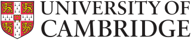

## Professional Experience

| Company  | Link  | Role  | Dates  | Location  |
|:--|:--|:--|:--|:--|
|   | [Canonical](https://canonical.com)  | Engineering manager  | July 2021 -- July 2023  | Remote  |
|   | [Nalej](https://nalej.com)  | VP Ecosystem Software and Services (Data/ML/AI)  | September 2017 -- July 2021  | Madrid  |
|   | [Novelti](https://novelti.io) |  Senior Information Technology Architect  | July 2016 -- August 2017  | Madrid  |
|   | [University of Cambridge](https://www.cam.ac.uk)  | Research Associate  | April 2015 -- April 2016  | Cambridge (UK)  |
|  | [INRIA](https://www.inria.fr) | Postdoctoral Research Scientist | April 2013 -- April 2015 | Rennes (France) |

## Education

* [**2009--2013**] [UC3M](https://www.uc3m.es) __PhD Computer Science__

  My PhD entitled **"Methods to enhance content distribution for very large scale online communities"** got *cum laude* and was awarded with the *2013 extraordinary thesis award*. You can download the manuscript [here](https://e-archivo.uc3m.es/bitstream/handle/10016/17178/tesis_juan-manuel_tirado_martin_2013.pdf?sequence=1&isAllowed=y) or visit the [University's repo](https://e-archivo.uc3m.es/handle/10016/17178). For more information regarding my research activities take a look at the [publications section]().

* [**2007--2009**] [UC3M](https://www.uc3m.es) __MSc. Computer Science__

* [**2002--2007**] [UC3M](https://www.uc3m.es) __BSc. Computer Science__

## Teaching activities

* [**2017**] __[U-TAD](https://u-tad.com/):__ __ML and Big Data for banking services__
  
  Introduction course for banking employees on how to use ML and data processing. The course included the main concepts of ML and data processing using Python and SciKit with and introduction to PySpark and big data.
  
* [**2016**] __[U-TAD](https://u-tad.com/):__ __MSc. in Big data__
  
  Introduction and advanced topics on ML and data processing. Practical work on how to use PySpark, Kafka, and stream processing.
  
* [**2015**] __[University of Cambridge](https://www.cam.ac.uk):__ __MSc. in Big Data__
  
  Assistant during the graph processing related lessons
  
* [**2011--2013**] __[UC3M](https://www.uc3m.es):__ __Computer Architecture__
  
  In the context of the BSc. in Computer Science at the Universidad Carlos III de Madrid, I was in charge of this course. Topics: parallel processing, distributed memory, computers architecture, high performance computing.

 
